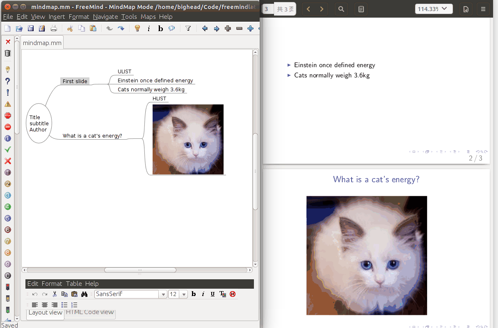

[](https://travis-ci.org/xuehuichao/freemind-latex)


# Focus on Ideas, and Slides will Follow
This tool converts a mindmap into PDF slides (via LaTeX beamer). You can write [complex yet fine-tuned slides](http://www.xuehuichao.com/thesis_slides.pdf) with this tool.



### Usage
Go to an empty directory and start editing it
```sh
cd /path/to/your/document/directory
freemindlatex
```

It will bring up freemind for editing, evince for slides preview, and keep monitoring the file changes. While you edit the mindmap, slides content will refresh.

## Why not just PowerPoint?

Tweaking fonts suck. But you do it all the time.

* During the first round.
* After you move slides.
* After you add content.
* After you indent a paragraph
* ...

With freemindlatex, we ask you to just focus on the logic.

* Work on the outline, with freemind.
* Auto formatting, with LaTeX beamer.
* Bonus: LaTex math equations for free.


## Installation

The software is packaged into a zip file. It definitely supports Mac and linux. Haven't tested
it on Windows, but it should work similarly.

First install [bazel](https://www.dropbox.com/s/rqxjr73o3rczos4/freemindlatex_app_main.zip?dl=0)

	curl -L https://github.com/xuehuichao/freemind-latex/archive/bazel.zip -o freemindlatex.zip
	unzip freemindlatex.zip
	cd freemindlatex
	./install.sh --package_directory=/path/to/installed/Packages --bin_directory=/path/to/bin

Also before running, make sure you install evince, or skim as the PDF viewer:

1. Evince, for linux and Windows: https://wiki.gnome.org/Apps/Evince
2. Skim, for MacOS: http://skim-app.sourceforge.net/


### Running LaTeX locally
By default, this tool connects to my server (sword.xuehuichao.com:8117) for LaTeX compilation.
You may also run latex on your own computer.
In this case, please make sure you have the full texlive (https://www.tug.org/texlive) installed.
1. On MacOS: https://tug.org/mactex/
2. On Ubuntu: `sudo apt-get install texlive-full`

Then, instead of `freemindlatex`, please run `freemindlatex local` in your working directory.


## For development

### Testing
```sh
bazel test ...
```

### Code style checking
```sh
find freemindlatex/ -name *.py |  xargs pylint --rcfile=.pylintrc
```
